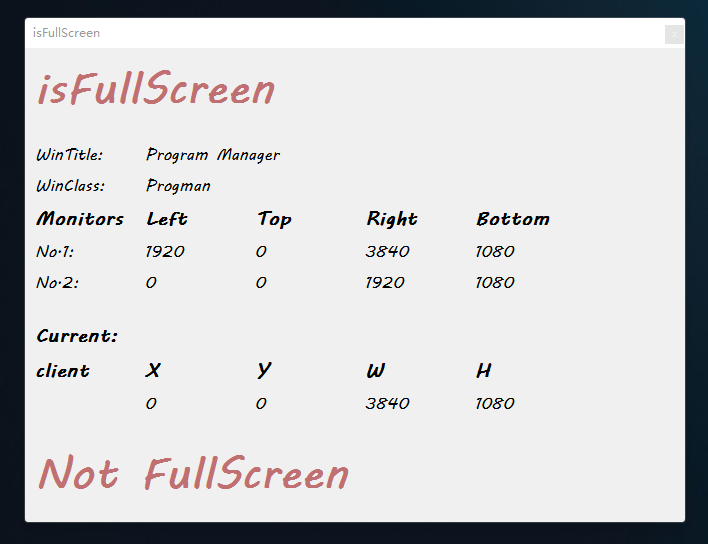
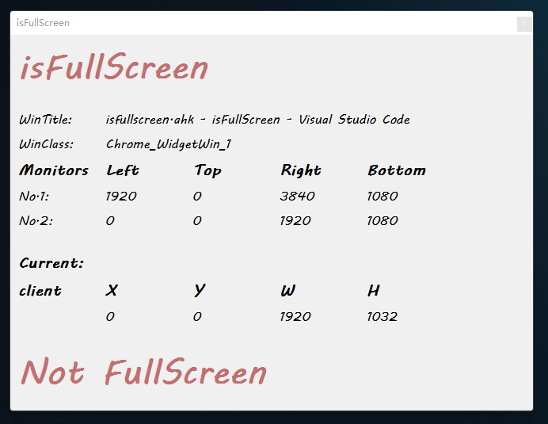
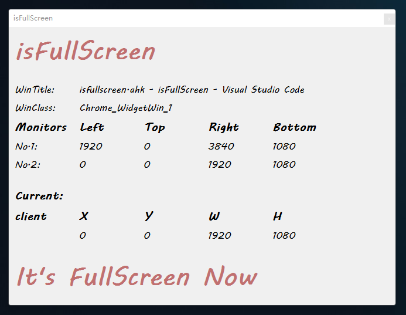

# isFullScreen

Checks if a window is in fullscreen mode.

**Notice:** Tested in `Autohotkey Version 2.0.18`

## Usage

```autohotkey
#include isFullScreen.ahk
isFullScreen()
```

## Example

`demo.ahk` is a simple usage example. You can run it and then switch between fullscreen and non-fullscreen windows, and you can see the detection results in real time on the demo GUI.

## Demo Screenshot


